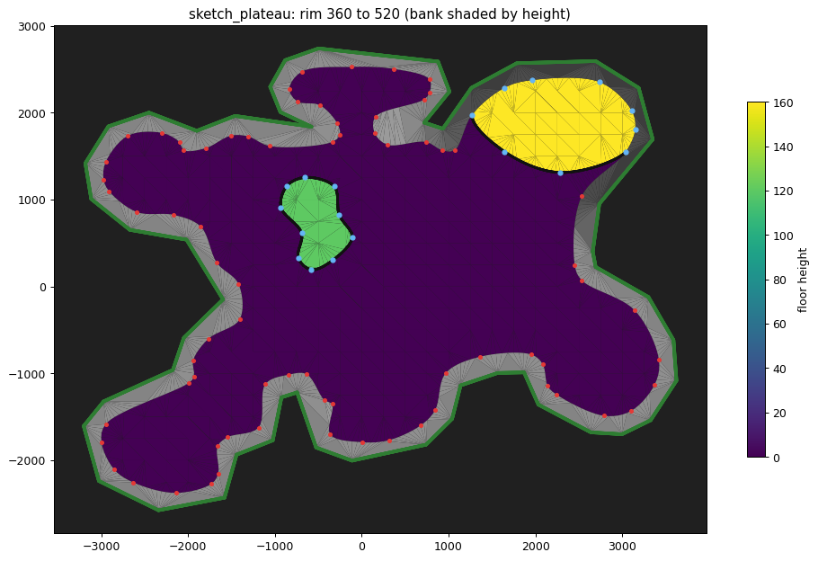

# Overworld level builder

The geometry core of a future standalone overworld level editor: Kokiri Forest-style levels
from an outline, regions raised or sunk inside it, and an edge of the world that builds itself.
Pure Rust with no engine and no Blender. A level document (JSON) and a theme (JSON) go in;
textured, watertight meshes come out. The editor (`../overworld_editor`) draws and edits documents, and
the game plays the export with child Link (`oot_sandbox --level`, `oot_import::level`, ADR 0035).

This crate started in the Blender MCP for level generation repo (pd-walk walking, Blender previews) and
moved here on 2026-10-05; its history up to the move is there (commit `21216d9`).



Builds and their textures (ROM data, so never committed) go in `out/overworld/`.

## Status (first milestone, 2026-10-04)

Done:
- An outline with **regions** inside it: floors raised or sunk, and ponds. Regions can be free-standing
  or drawn against the outline (sharing its nodes).
- **Walls** wherever heights differ, styled and textured automatically.
- **The boundary:** a cliff from each floor up to the rim, a bank, then trunks and foliage standing on
  the bank's edge, attached. The rim **rises gradually** over high ground near the edge.
- `tools/trace_sketch.py` turns a Paint sketch into a document. The test levels in `examples/sketch`
  are traced from the user's drawing at 8 units per pixel: about 7,750 x 5,350, roughly 2.8 times
  Kokiri village's width. The user wants big maps, where the same walls are short against the level.

- **Paths** (2026-10-05): ramps and embankments joined to the ground, bridge decks with open space under them, and
  paths that switch from one to the other. All walked end to end in pd-walk before the move (`examples/sketch/sketch_paths.json`).
  Since then, a ramp running on past a plateau's edge cuts into the plateau instead of landing at the edge.

- **The editor** (2026-10-05, `../overworld_editor`, see its README): draw and edit the outline, regions and paths over a
  plan of the built level, with a 3D view beside it and a side profile for paths, where heights are set by dragging. It
  rebuilds in the background on every edit, and **▶ Play** plays the level in the game with child Link and the pad, which
  reloads each rebuild.

- **Bumps** (2026-10-05): smooth noise on the ground and on any region's floor, fading out towards each floor's edges.
  Walls, the rim, paths and bridges are untouched (tested). Example: `examples/sketch/sketch_bumpy.json`.

- **Painted terrain** (2026-10-05, `src/terrain.rs`): a smooth height offset over the whole level, painted with the
  editor's brush. Everything rides on it; ponds stay level. Example: `examples/sketch/sketch_hills.json`.

- **Detail** (2026-10-05): `settings.detail` high (the default, unchanged), medium or low. `sketch_hills` is 24,254 /
  7,815 / 5,011 triangles and looks nearly the same at each.

- **Props** (2026-10-05, ADR 0036): Kokiri Forest's houses, stumps, stepping stones, hedge, log tunnel and crawlspace,
  cut from the extract by a committed manifest (`kit/kokiri.json`, `src/pieces.rs`) and placed in the document (`props`,
  `src/props.rs`). They stand on the finished ground, with their collision, and are counted against the game's 8192
  collision vertices. Example: `examples/sketch/sketch_village.json`.

- **Every overworld region** (2026-10-09): each overworld scene is a region with its own manifest
  (`kit/<region>.json`): its textures as a named library, its reusable structures as kit pieces (201 in all), and,
  for 19 of them, a theme (`themes/<region>.json`). See Regions.

- **Dirt paths** (2026-10-05, `lines` of kind `dirt`, `src/lines.rs`): painted into the floor, not laid on it. The floors
  take points on rings round the path, and the ground blends from grass to dirt by vertex weight, as Kokiri's ground
  combiner blends its two textures.

- **Fences and hanging bridges** (2026-10-05, `lines` of kind `fence`, `lattice`, `bridge`): fences stand on the ground with
  a post at every node; rope bridges sag between their anchors on a catenary, and Link walks across.
- **Hedges** (2026-10-05, `lines` of kind `hedge`): walk-through tall grass over any shape of nodes, drawn like a region.
- **Wall openings** (2026-10-05, `src/openings.rs`): the log tunnel and the crawlspace set into the wall nearest where they're
  put, with a gap cut to fit; vines and the waterfall stand on walls. Link walks into the log and crawls through the
  crawlspace.
- **Areas and tunnels** (2026-10-06, `lines` of kind `tunnel`, `src/tunnels.rs`): a region drawn outside the outline is an
  area of its own, with its own edge of the world; a tunnel Link walks through goes from a wall to a wall, through a ridge,
  under a plateau or from one area to another, along a curve through its nodes, with rough cave walls if wanted.
  Example: `examples/sketch/sketch_tunnels.json`.
- **Edge profiles and pits** (2026-10-08, `src/profiles.rs`): a region's edges, all of them or one at a time, can be a
  slope, terraces, an overhang or ragged rock instead of a cliff, built inward from the edge so the footprint stays as
  drawn; and a region can be a pit, a drop into the void. Example: `examples/sketch/sketch_profiles.json` (a rolling
  hill, a mesa with one sloped side, a terraced hollow, a lake with a shelving bed, a stepped hillside, an overhanging
  ragged crag, a chasm).

- **Themes, stacks and what's beyond the outline** (2026-10-08): a level's theme is Kokiri Forest's or Kakariko's, and a
  level can pin any theme's styles (Themes). A region's edge can be a stack of walls and slopes with their own looks
  (Stacks), and an outline edge can have ground beyond it climbing to a crest instead of the forest (Beyond the outline):
  Kakariko's brick and rock under Death Mountain Trail, its cliff and grass slope, its mossy south wall. Example:
  `examples/sketch/sketch_kakariko.json`.
- **Rocks and arches** (2026-10-08, `src/rocks.rs`): freestanding rocks lofted from a footprint up through contours
  (boulders, mesas, spires, mushrooms, pillars, leaning rocks, with lumps and layers), and natural rock arches standing
  on the ground between two points. Example: `examples/sketch/sketch_rocks.json`.

Not yet: exits and doors that lead somewhere (they wait for levels to load through `Play_Init`).
See the roadmap.

## Usage

From the repo root:

```
cargo run --release -p overworld_editor -- crates/tools/overworld/examples/sketch/sketch_paths.json
cargo test --release -p overworld -p overworld_editor
target/release/overworld kit-textures [region...]   # the extracted scenes -> out/overworld/textures/<region>
target/release/overworld kit-pieces [region...]     # kit/<region>.json + the extract -> out/overworld/kit/<region>/pieces.json, thumbs/
target/release/overworld kit-survey <region> [--box x0 y0 x1 y1] [--below z]   # what a scene is made of -> out/overworld/survey/<region>
target/release/overworld preview <level.json> <out.png> [--theme <theme.json>]  # a level drawn from the south-west and above
target/release/overworld build crates/tools/overworld/examples/sketch/sketch_plateau.json out/overworld/sketch_plateau [--kit <dir>]...
target/release/oot_sandbox --level out/overworld/sketch_plateau --child   # play it (reloads on rebuild; --at x,y,z,yaw places Link)
python crates/tools/overworld/tools/trace_sketch.py sketch.png level.json --scale 8 --region blue:z=120 --region red:kind=water,z=-100,surface=-20
python crates/tools/overworld/tools/plan.py <out>/level.json plan.png --doc level.json   # floors by height, bank, walls, tree line
```

`OW_TIMING=1` prints each build phase's time (the CLI and the editor; the editor adds its own handling of each build).
`sketch_hills` builds in about 75 ms: the tree line's distance field and the floors' edge distances use a segment index
(`geom::SegIndex`, `row_crossings`) instead of testing every outline segment, which took the edge of the world from
about 200 ms to 12, with byte-identical output.

Output (`<out>/`): `level.json` holds objects (ground, water, walls, boundary, trees, foliage, overlays)
with vertices, triangles, per-corner UVs, a material role and a collision surface role per triangle.
`level.obj` and `level.mtl` are for any tool (OBJ is y-up), with the textures the level uses copied
into `textures/` from the texture libraries (`--textures`, as often as needed; by default every theme's). A library is
a folder of PNGs plus `textures.json`, giving each texture's wrap per axis, alpha (opaque, cutout or blend) and
culling: `out/overworld/textures/kokiri` and `.../kakariko`, written by `overworld kit-textures` (`src/kit.rs`) from
the extracted scenes' glbs (ROM data, git-ignored; the editor makes them on first start). The MTL gives `map_Kd`, `map_d`
for alpha and `d` for translucency; material names carry the GE64 dialect's flags
(`forest_trunks_ClampT_Cutout`), which pd-walk and Blender's OBJ import read. In `level.json`, the axes
are x east, y north, z up, and heights are absolute: the game reads it (`oot_import::level`, ADR 0035).

## The level document

```json
{ "name": "sketch",
  "outline": { "nodes": [[x, y], ...], "z": 0, "noise": { "amplitude": 70, "scale": 900, "edge": 300 },
               "beyond": [null, { "z": 940, "profile": { "kind": "stack", "parts": [{ "kind": "wall", "rise": 330 }, { "kind": "slope", "angle": 36 }] } }] },
  "regions": [ { "name": "pond", "nodes": [[x, y], [x, y, 1], ...], "z": -100, "kind": "water", "surface": -20 },
               { "name": "ledge", "nodes": [...], "z": 160, "edge": "vines", "noise": { "amplitude": 30 } },
               { "name": "hill", "nodes": [...], "z": 220, "profile": { "kind": "slope", "angle": 22, "round": 0.7 } },
               { "name": "mesa", "nodes": [...], "z": 320, "profiles": [{ "kind": "slope", "angle": 30 }, null, null, null] },
               { "name": "chasm", "nodes": [...], "z": -600, "kind": "pit" } ],
  "paths": [ { "name": "ramp", "nodes": [[x, y], [x, y]] },
             { "name": "bridge", "nodes": [[x, y], [x, y, z, width], [x, y]], "mode": "floating" },
             { "name": "climb", "nodes": [...], "modes": ["attached", "floating"], "width": 160, "edge": "vines" } ],
  "boundary": { "cliff_min": 280, "bank": 220, "bank_rise": 80, "rise_slope": 0.25, "reach": 300, "panel_tol": 90 },
  "settings": { "sample": 60, "steiner": 250, "weld": 1, "theme": "kakariko" },
  "props": [ { "piece": "saria_house", "at": [200, -1300], "yaw": 20 },
             { "piece": "stone_large", "at": [-420, 860] },
             { "piece": "hedge", "at": [-1700, 600], "yaw": 30, "scale": [1.5, 1.5, 1] } ],
  "lines": [ { "name": "main path", "kind": "dirt", "nodes": [[-1470, -1180], [-900, -800], [-250, -650]], "width": 160 },
             { "name": "pen", "kind": "fence", "nodes": [[-40, -230], [-420, -260], [-440, -520]], "closed": false },
             { "name": "rope bridge", "kind": "bridge", "nodes": [[880, 1330], [1780, 1760]] },
             { "name": "cave", "kind": "tunnel", "nodes": [[-1300, -100], [-250, 120, 40], [800, 0]], "width": 200, "height": 200,
               "noise": { "amplitude": 25, "scale": 300, "edge": 120 } },
             { "name": "mesa", "kind": "rock", "nodes": [[-2100, 400], [-1700, 700], [-2100, 1000], [-2500, 700]],
               "contours": [{ "z": 380, "scale": 0.86 }], "layers": { "height": 120, "depth": 14 } },
             { "name": "arch", "kind": "arch", "nodes": [[-1200, 1700], [300, 1800]], "height": 560 } ] }
```

- **Nodes are control points.** Edges between them are smooth curves (centripetal Catmull-Rom). A
  third value of 1 marks a sharp node. `settings.edges` changes that for the whole level (see Edges below).
- **One web of shared nodes.** A region's node within `weld` of another loop's node *is* that node,
  so a region drawn against the outline shares the outline's edge. Each edge is sampled once, and
  everything touching it uses the same points, which is why the result is watertight. Loops may share
  nodes and edges but may not cross or overlap (refused with the place where they do).
- **Faces.** The web cuts the plane into faces. Each face belongs to the innermost loop around it,
  which gives its height, so nesting (a region inside a region) just works.
- **Areas.** A region drawn outside the outline (and round nothing) is an area apart from the rest: the web has a second
  outer edge, and the edge of the world (cliffs, bank, trees) goes round each. The editor starts one at the ground's
  height. Tunnels join areas (see Tunnels). Areas closer than twice the bank are reported: their forests would run into
  each other.

## Bumps (`noise` on the outline or a region)

`{ "amplitude": 20, "scale": 600, "edge": 200, "seed": 0 }` (the defaults): smooth noise (`noise::relief`, three octaves,
stretched to use its range) of up to `amplitude` up or down, with features about `scale` across. It fades to nothing
within `edge` of each face's edges, so every edge keeps its floor's height. That's what keeps the rest of the level exactly
as it was: wall tops and feet, the rim, path landings and bridge ends all sit on edges, and faces under an attached path
take the path's surface with no bumps (tests `bumps_change_only_the_ground_inside_floors`,
`paths_keep_their_surface_over_bumpy_ground`). Noisy floors get interior points every `scale / 4` (at least 40, at most
`steiner`), so `sketch_bumpy` has about 650 more ground triangles than `sketch_paths`. A pond's bed stays 5 under its
surface. Each region's pattern differs; `seed` and `settings.seed` vary them.

Seen from PD's eye height, ±35 hardly shows, because the theme's shade variation mottles flat ground as much. ±70 over
900-unit hills reads well. The edge fade hides bumps where
they'd show most, at the foot of walls. Letting them run to walls (walls following them) is the next step, with the brush.

**Under props** (2026-10-06): houses, stumps and hedges level the bumps under them (`props::pads`, `Builder::floors`), so
they stand level instead of a corner sinking in or floating. A prop's pad is its **base outline** (`Piece::base_outline`:
the hull of what's within 10 of its base, so a house's walls, not its eaves) plus its doorway, grown by 15. Inside, the
floor is flat at the bump at the prop's anchor, so the prop stands where it would anyway, just level. Around it, the
bumps come back over a skirt `max(3 x amplitude / tan 30°, edge / 2)` wide (smoothstep, so never steeper than 30°):
about 100 at amplitude 20, 360 at 70. The pad's edge goes into the floor as constrained edges (points as far apart as the
floor's own), so every triangle under the prop is exactly level; the floor's own points take the skirt.
Nothing is stored: the pads come from `doc.props` on each build, so moving a prop moves its pad and deleting it brings
the bumps back. Overlapping pads: the later prop wins. A prop's `"level": false` (or true) overrides its kind; a prop
with its own `z` and openings and wall pieces never level. Cost: `sketch_village` with ±40 bumps everywhere has 312
more ground triangles for its nine levelled props (1,377 vs 1,065). Painted terrain isn't levelled yet: a prop on a
painted hill still tilts against it (Link's house in `sketch_village`). Test: `props_level_the_bumps_under_them`
(level, told not to, moved, deleted).

## Painted terrain (`terrain` in the document, `src/terrain.rs`)

`{ "cell": 50, "detail": 100, "chunks": { "cx,cy": [256 offsets], ... } }`: height offsets at grid nodes `cell` apart,
in 16 x 16 chunks (missing chunks are flat), bilinear between nodes. The editor's brush paints it: raise, lower, smooth
(towards the neighbours' average, over a kernel that grows with the brush), flatten (towards the offset where the stroke
started), bumps (`noise::relief`) and erase.

It's applied to the **finished** level as a deformation: every vertex moves up by the offset at its (x, y), before the
lighting is baked (so hills are shaded). Because the offset depends only on position, shared vertices stay shared and
vertical walls stay vertical: walls keep their heights, ramps and bridges keep their shapes relative to the ground, and a
hill painted under a plateau lifts the plateau, its ramps and the bridge ends landing on it. Region heights stay what they
are in the document. Water has to stay level, so a pond takes the offset at its middle all over, blending back to the
painted offset within 250 of its shore (`terrain::Field`). Floors get extra points every `detail` wherever the terrain
varies. A path the terrain steepens past walkable is reported. Tests: `painted_terrain_moves_everything_with_the_ground`
(every non-ground vertex moves by exactly the offset under it, still watertight, ponds level) and the brush tests in
`terrain.rs`. `sketch_hills` (a hill under the island, a rise and a hollow, written by `make_levels.py`) was walked end to end in
pd-walk before the move, with one waypoint on the hill's flank as a pass-through.

## Edges (`settings.edges`)

How the outline's, regions' and paths' edges run between their nodes (2026-10-05; dirt lines follow the paths'):

| | |
|---|---|
| `smooth` (default) | The curves, as before. |
| `faceted` | The same curves as a few long flat panels: corners where the curve strays more than 20 (`doc::FACET_TOL`, or the detail's tolerance if larger) from a straight piece, about 16 round a circle 1000 across. Low-poly, as the game's walls are. |
| `hard` | Straight from node to node, every node a corner: the shape is exactly the nodes you placed. |

The straight pieces still get a point every `sample` (or the detail's longest piece; `geom::Sampling::Facets` and
`Straight` cut along the chord), so painted terrain and walls follow the ground along them. That's why faceted
isn't lighter at high detail, but at medium `sketch_village` goes from 5,737 triangles to 3,982 (faceted) and 3,796
(hard). Straightened edges can cross where the curves didn't: the build reports where. Test:
`faceted_and_hard_edges_are_lighter_and_still_watertight`.

## Wall texture (`settings.wall_texture`)

How capped walls (the cliffs, the edge of the world's too) are textured (2026-10-05):

- `tiled` (the default): the grassy top and bottom caps keep their size and the rock between repeats, so every wall is
  as sharp as a short one (see Automatic texturing).
- `stretched_middle`: the caps keep their size and the rock between is stretched once over the rest of the wall. The
  middle is plain rock, so it blurs little, and the crisp grass edges are what make walls look sharp. Lighter than tiled.
- `stretched`: the texture once over the wall's height (v 0 at its foot, 1 at its top, the caps stretched with it), and
  across it as many units per repeat as keeps the texture's shape (`tile_u` x the run's mean height / `tile_v`). This is
  how Kokiri Forest's own walls are: blurrier on tall walls, and where walls of different heights meet the texture
  doesn't line up. Embankment sides and the rock under bridges stay top-anchored; rocks and standalone arches follow
  the setting (see Rocks and arches). Test: `walls_tile_or_stretch`.

`sketch_village`, triangles at high / medium / low: tiled 11,075 / 5,589 / 3,960, middle stretched 9,043 / 5,589 /
3,960 (the same at medium and low: one middle band either way), stretched 7,007 / 4,145 / 3,028. Before the middle grew
(below), tiled was 13,467 / 5,737 / 4,076.

## Detail (`settings.detail`, `doc::Detail`)

| | High (default) | Medium | Low |
|---|---|---|---|
| Outline and region curves | every `sample` (60) | within 2.5 of the curve, pieces up to 4 x `sample` | within 6, up to 8 x `sample` |
| Path stations (embankment sides, bridge arches) | every `sample / 2` | within 2.5, up to 2 x `sample` | within 5, up to 4 x `sample` |
| Capped walls | a band per middle repeat | three bands | three bands |
| Flat floors' points | `steiner` | 1.6 x | 2.4 x |
| Painted terrain's points / bumps' points | `detail` / scale over 4 | 1.5 x / over 3 | 2 x / over 2 |
| `sketch_hills` | 24,254 triangles | 7,815 | 5,011 |

High builds exactly what it always did. Adaptive curves (`geom::sample_curve`) sample densely, keep what Douglas-Peucker
needs to stay within the tolerance and cut long pieces evenly, so straight stretches become long panels, as Kokiri's
are. **Three-band walls** are the big saving: the cliff texture's middle used to be a band of its own for every
repeat (about 13 bands on a 400-unit cliff, when the middle was rows 5 to 9). At medium and low the middle is one band
with a texture of its own, the middle rows, mirror-repeating vertically. That texture is derived from the library's PNG
(`textures::derived_name`, e.g. `kf_cliff@5-26m`, written as `kf_cliff-rows5-26.png`, material role `cliff~mid`, OBJ
material `cliff-mid_MirrorT`), so the kit needs nothing new. Three-band walls don't fold (see Automatic texturing): the
fold's two bands cost about a fifth more, so their repeats stretch a little instead. Tests: `lower_detail_is_lighter_and_still_watertight`,
`derived_textures_are_rows_of_their_base`. Before the move, Low walked pd-walk's route over `sketch_hills` with
the two hill-flank waypoints as pass-throughs. For N64 use the derived middle (32 x 5) isn't a power of two yet.

For comparison, Kokiri Forest is about 3,750 triangles in all, in about an eighth of the sketch levels' area. A real
N64 port would also need the level split into rooms.

## Paths (`src/paths.rs`)

A path is a line of nodes `[x, y]`, `[x, y, z]` or `[x, y, z, width]`. Between nodes it's a smooth curve, with
heights linear along it.
- **Heights fill themselves in.** An end with no z takes the floor's height there, and a node between ends with
  none is interpolated. A ramp is just two points, one on the ground and one on a plateau.
- **Cuttings.** An attached end's slope runs all the way to its node. A ramp from the ground to a point halfway
  into a plateau rises to the plateau's edge as an embankment, then goes on into the plateau as a cutting, reaching
  the top at the node. Put the top node at the edge to land flush there (a node a little inside leaves a low lip).
- **Landing.** A floating end standing on a floor of its own height, where the ground falls away further in, lands
  at that floor's edge: the deck starts exactly at the edge, however far onto the plateau the node is.
- **Attached** segments are embankments and cuttings. Their footprint joins the web, and inside it the ground is the
  path's surface, above the region's or below it (where two paths overlap, the higher). A ramp drawn overlapping a
  cliff therefore meets it edge to edge if it's higher there, and cuts a notch into it if it's lower. The forest rim
  rises over a path like any high ground. Footprints may cross anything: every crossing becomes a vertex, and the
  part outside the outline is cut off. Where a ramp rises past the floor beside it, the wall between them changes
  sides at the crossing point. The sides, an embankment's and a cutting's, use the theme's `embankment` style (a
  path's `edge` overrides it). That style is **top-anchored**: the grass lip follows the top edge, and the rock
  repeats down at its own size until the ground cuts it off. With `settings.wall_texture` stretched, it's shown once
  over the tallest height of that run of wall instead (and stretched-middle: its caps at their size, its middle once
  between them), anchored at the top the same way: the size a cliff that tall is drawn, so a ramp's sides match the
  cliff they climb (`Builder::anchored_bands`, which the floors' edge points follow too). Test: `a_ramp_into_a_plateau_cuts_in`.
- **Floating** segments are bridges. The deck's top is world-projected. Where it lands, its end follows the floor's
  own edge: the deck's sides are passed to the map as probes, so their crossings become floor vertices, and the end
  shares them. Below the deck is the theme's (or the path's `shape`) body:
  - `rock`, a natural arch (Zora's River style). Each cross-section runs down a lip from the deck's edge, bulges
    out, and curves round to a rounded bottom. It's deep where it meets the ground and thin mid-span, with lumpy
    noise. It's textured like a top-anchored wall, by arc length down from the deck's edge, so the grass lip sits
    under the deck's edge. Both halves meet on the bottom line, vertex for vertex (exactly since 2026-10-08, lumps and
    all: a lump there moves both straight down), and a free end's face goes through the body's own end points. It
    carries on into the ground it lands on, hidden behind the cliff, and back into an embankment it continues, without
    bulging out of it. A standalone arch is the same body swept along a curve (`rocks::sweep`; see Rocks and arches).
  - `slab`: an underside and edge strips over the deck's `thickness`.

  There is an end face only where an end is free.
- **Buried stretches are cuttings.** Wherever a floating stretch is below the ground under it anywhere across its width
  (it runs on into a higher floor, below its top), it's attached there instead: a cutting, as an attached path's is.
  It changes at the exact point, so the cutting covers the higher floor's edge where it crosses, and the deck starts
  clear of it, abutting the cutting (2026-10-08).
- Slopes steeper than the theme's `max_slope` (35°) are reported. A footprint that folds over itself (too tight
  a turn for its width) is refused.

**Stitching.** Everything meets vertex to vertex:
- Floors take extra points on their edges wherever an embankment's texture bands meet them, or a wall changes
  sides partway along.
- Top-anchored walls split at every height another wall meets their ends.
- Deck ends share the floor's edge.

Tests: `levels_with_paths_are_watertight_too` (ground, walls, cliffs, bank and trees share every edge) and
`a_deck_meets_the_floor_it_lands_on_edge_for_edge`.

**Stairs** (`"look": "steps"`, 2026-10-08): Kakariko's stairs aren't steps but a ramp at 1 in 2 (26.6°) with steps drawn
on it, one every 22.4 along its surface (10 up, 20 along), and the triangle under each side is one texture stretched
over the whole stair, its diagonal the stairs' profile. A path with the look `steps` is the same: its attached runs are
drawn with the theme's `steps` (the tread twice across, mirrored, so its middle is a seam as Kakariko's is; one step per
`step` along the surface; colliding as `stone`), and its sides (unless the path sets its own `edge`) with the steps' side
style, re-mapped once over each stair (u from its low end to its high end, v from its foot to its top: `stair_sides`).
For Kakariko's proportions draw the ramp twice as long as it climbs. The profile texture only fits that slope (its diagonal
is the slope), so stairs more than 5° off 26.6° (`theme::PROFILE_FIT`) get the steps' `tiled` style on their sides
instead: Kakariko's brick without its grass lip (`brick_plain`, the brick's middle rows), repeating every 280 along and
every 236 up from the stair's foot, so the bricks are one size all over (a wall's own v is per column, which would
stretch them on a side whose height runs to nothing). Where
stairs cut into higher ground, the walls above them are the steps' `cutting` style: Kakariko's brick with its grass top,
top-anchored (`brick_top`), so the grass follows the higher floor's edge. A theme without stairs (Kokiri) borrows
Kakariko's.

Walls of different styles meeting at a corner split their columns at each other's heights however close (within 0.01;
it used to be 0.5, which left gaps where two styles' cap lines fall a fraction apart).
Collision is the ramp, as in the game. Test: `stairs_are_a_ramp_with_steps_drawn_on_it`.

**Dirt** (`"look": "dirt"`, 2026-10-08). A path on the ground at the ground's height *is* the ground, so it shows only
where it climbs, sinks or has a section. With the look `dirt` the theme's dirt is painted along it, as a dirt line is
(see Dirt paths): one along its laid-out centre line, as wide as the path less the dirt's soft edge and wander, so it
fades out by the path's own edge. Junctions then show as dirt meeting dirt.

**Sections** (`"section": {"kind": ...}`, or per segment `"sections": [...]` as `modes` is to `mode`, 2026-10-08). A
path's cross-section, `doc::Section`:

| Kind | What it is | Numbers |
|---|---|---|
| `causeway` | an embankment with a flat top, raised above its line | `height` (60) |
| `sunken` | a lane in a cutting, sunk below its line, walls up both sides | `depth` (120) |
| `ledge` | cut along a cliff: draw it along the cliff's edge, half in and half out. Its walls, the one above it and the drop below, are the cliff's own (the highest region it's cut into: its `edge`, its stack's part there, else the theme's rules), not the embankment style | none |
| `boardwalk` | planks on posts, raised above its line, open underneath. Its segments float whatever their mode | `height` (80), `spacing` (200) |

The height the line gives is still where it was: a section raises or sinks the surface from there by the same amount
all along its segments, ramping back at `paths::RAMP` (25°) at the path's ends (inside the end segment, so the end
still meets the ground as drawn) and where one segment's section meets the next's (centred on their node). A ramp
keeps to the half of each segment beside it, so on a short segment it's steeper, and reported if past walkable.
A boardwalk's deck is the theme's hanging-bridge planks (`hanging.deck`, one every `plank` along, `across` repeats
over the width, colliding as `planks`), 12 thick (`BOARD`), the logs' ends round its edges and under it; a pair of
posts (`hanging.post`, twice the rope bridge's post size) every `spacing`, from its underside to 20 into the ground,
wherever it stands more than 10 clear of it. A floating end whose section raises or sinks it (a boardwalk's always
does) doesn't land on the floor's edge as a bridge's does: it ramps on to its node, where it meets the ground, so put a
boardwalk's ends on the shore where it should touch down (landing there pulled a deck already partway up its ramp down
to the shoreline, twisting its end).

**Railings** (`"railings": "fence"`, any fence kind of the theme's). Along both sides, 8 in, wherever the floor
just outside the side is 40 or more (`doc::RAIL_DROP`) below the path's own, read off the built ground: a causeway's
and a boardwalk's sides, a ledge's drop, a high ramp's sides, never a sunken lane's. Runs shorter than 120 aren't
put up. Each is a fence line (`lines::fence`), so it stands on the surface and collides as fences do.

Test: `sections_raise_sink_cut_ledges_and_build_boardwalks`; example `sketch_sections.json` (a ledge with railings
climbing a mesa's cliff, a causeway over a marsh, a sunken lane, a boardwalk).

**Junctions** (`paths::layout_all`, 2026-10-08). Paths meet without steps:
- **An end on another path joins it.** An attached end whose node lies on another path's attached footprint (within
  its half width of the centre line) takes, unless its node gives a height, the other's line height there, and its
  section ramps to the other's raise there: a plain path climbs onto a causeway, a causeway joining a causeway stays
  level. Draw the end anywhere on the other path; on its centre line is tidiest.
- **Two ends meeting** (an L, or one path carrying on from another: each end on the other's footprint) both run on
  past their node, flat, by the other's half width less 1, so the outer corner is covered. (Exactly the half width
  would put each end on the other's far edge, and the map doesn't take coincident edges.) The earlier path keeps its
  section to its end; the later one ramps to it.
- **Where they overlap**, the ground is the paths' surfaces weighted by how far inside each footprint the point is
  (`Builder::surface`), so it meets each path's own surface along that path's edge. That holds for joined paths and
  for paths whose centre lines cross within `paths::JOIN_DZ` (40) of each other's height (a crossroads). Further
  apart, the higher is the ground, as before (a ramp over another's cutting).
- **A path running into another eases onto it** within its own width of the other's footprint (`Builder::path_z`),
  so where a branch meets a sloping path's side the corners meet too, and no sliver of wall is left.

**Switchbacks** ("make it walkable", `"switchbacks": {"width": 700, "grade": 20, "turns": "round", "first": "left"}`,
`paths::meander`, 2026-10-08). A path of two nodes climbs between them in a zig-zag the builder solves: you give the
slope, not the geometry. Its turns are evenly spaced along the line between the nodes, each a half circle out to the
side of a corridor `width` wide (else four path widths) centred on that line, the legs straight between them,
alternating sides (`first`: which side the first leg heads to). It takes the fewest turns that keep the climb at
`grade` (20°) or under. Adjacent legs stay `paths::LEG_SPACING` (1.25) path widths apart, centre to centre, which
caps how many turns fit; if they aren't enough it takes them all and the build says how wide the corridor would have
to be. A corridor narrower than 2.25 path widths can't turn at all (the half circle's inside would fold): it's
reported and the path goes straight. `round` turns climb with the legs (one slope all along); `flat` turns are level
landings, the legs steeper between them. Heights run by the distance climbed between the ends (`layout_inner`'s
`climbs`), not node by node, so a floating switchback that lands on the plateau's edge before its last node finishes
its climb at the landing. A switchback's floating ends don't land at all, though: its climb carries on to its end node, as
an attached one's does, and the stretch inside the higher floor is a cutting (below). Its section, look and railings apply all along it; its ends join other
paths as any end does. The editor draws the zig-zag in the plan, and the side profile shows it, the two nodes at its
ends. Tests: `switchbacks_zig_zag_to_keep_the_climb_walkable`, `switchbacks_climb_a_cliff_at_a_walkable_slope`.

Floors take the points where walls meet them on their edges at the edge's own height, linear between its ends as the
walls' feet are (`floors`, `on_edges`): a path's surface along a tight curve isn't quite linear, and the two used to
miss each other by a few hundredths.

Layout goes round until nothing changes, so a path joining one that joins a third gets its final height. The
editor's side profile is laid out the same way. Test: `paths_join_without_steps` (a T onto a sloping path, an L off
its end, a crossroads); `sketch_sections.json` has a plain spur climbing onto the causeway, a road on from the
ledge's top, a crossroads, and a branch ramping down into the sunken lane, all dirt.

Not yet: supports under long bridges.

## Props and the kit (`kit/kokiri.json`, `src/pieces.rs`, `src/props.rs`, ADR 0036)

**The kit.** `overworld kit-pieces` cuts Kokiri Forest's pieces out of the clone's extract (`spot04.glb` for the meshes,
`collision.json` for the collision) into `out/overworld/kit/kokiri/pieces.json` (ROM data, never committed). The editor
does it on first start and whenever the manifest changes. The manifest says, per piece:

- **Source:** a box in the scene (x east, y north, z up). It takes every connected piece of a room mesh wholly inside it,
  or, with `materials`, the faces of those roles (for pieces joined to the terrain: the log tunnel, the crawlspace).
  Collision is every poly wholly inside the box. Each spot04 surface type maps to a collision role in the manifest's
  `surfaces`; an unmapped one fails the cut.
- **Frame:** `origin` (base, top, door, or a point) and `facing` (door, normal, or a direction). A piece is stored with
  its origin at 0 and facing +y.
- **Scale limits**, **door** (exit and entrance, checked against the doorway's floor) and **opening** (for pieces set
  into walls).

| Piece | Size | Notes |
|---|---|---|
| `link_house` | 554 x 587 x 435 | Door on the porch, 181 up; the ladder climbs to it. Fixed size. |
| `mido_house`, `saria_house`, `twins_house`, `knowitall_house`, `shop` | 185 to 349 tall | Doorway at the origin. x1 to x1.5. |
| `stump_post`, `stump_post_tall` | 98 x 98 x 120 / 180 | Where spot04's plank walkways land. |
| `stone_small`, `_medium`, `_large` | 80 to 120 wide | Origin on top: stands in water 15 above the surface. |
| `hedge` | 174 x 235 x 28 | Tall grass: Link wades through it (its walls and top only stopped the camera, so the kit drops them), on tall-grass footsteps. Spot04's has skirts on two sides; the kit adds the rest (`close_sides`). Kept for older levels: new hedges are drawn as shapes (Hedges below), and the editor's Kit panel no longer lists it. |
| `log_tunnel` | mouth 221 x 220, 857 deep | Both of spot04's log exits (Hyrule Field, Lost Woods) are this model. |
| `crawlspace` | 40 wide, 27 high, 320 long | Wall type 5 at both mouths. |
| `vines`, `waterfall` | | Wall pieces: climbable vines, a translucent fall. The vines tile (`"tiles": true`): see Wall openings. |

Houses bring their door shadows (decals) and Link's house its graffiti and mushrooms.

**Props.** `props: [{ "piece", "at": [x, y], "z"?, "yaw"?, "scale"?, "level"? }]` in the document. `yaw` is degrees
counter-clockwise from north; `scale` is along the piece's own axes, kept within its limits. After the painted terrain
moves the ground, and before lighting:
- each prop's origin stands on the highest floor under its anchor (a house's doorway, otherwise its origin), or at `z`
  if it has one;
- a stone stands in water 15 above the surface.

Its triangles keep the source's normals and tints (object `props`). Its collision goes into object `props_collision`,
never drawn (`"render": false`), with roles the game knows: wood, dirt, stone, planks, fence, ladder, ladder top, crawl,
door, exit. Doors and exits collide as plain floor: they lead somewhere once levels load through `Play_Init` (ADR 0035's
next step). Ground falling more than 20 below a prop's base under its base outline is reported. Houses, stumps and hedges
level the bumps under them (`"level"` overrides): see Bumps.

**The collision budget.** `Level::collision_vertices` counts what the game's collision will hold (corners merged at
whole units, as `CollisionBuilder` does): at most 8192. `sketch_village` at medium detail is 2,933, the game's own count.

Tests: `the_kokiri_pieces_come_out_of_the_extracted_scene` (the counts match the old Blender kit's; doors, the ladder,
the log tunnel's opening, the crawlspace; skipped without the extract), `props_stand_on_the_ground_turned_and_scaled`,
`houses_stand_on_their_doorway_and_stones_in_water`. In the game, Link climbs Link's house's ladder onto its porch
(`oot_sandbox --level out/overworld/sketch_village --child --at=-1470,250,1000,0 --script hold --frames 300`).

Openings and wall pieces (kinds `opening` and `wall`: the log tunnel, the crawlspace, the vine patch, the waterfall) aren't
stood on the ground but fitted to the nearest wall: see Wall openings.

## Regions (`kit/<region>.json`, `src/kit.rs`, `src/pieces.rs`, `src/survey.rs`)

Every overworld scene is a region (`kit::REGIONS`, the editor's order), each with a manifest giving its label, its
source (glb and collision.json), its texture library (`textures`), its collision overrides (`surfaces`) and its pieces.
The manifests are read when the tools run (`kit::scenes`, `kit::load_scene`); the themes are built in.

| Region | Scene | Prefix | Pieces | Theme |
|---|---|---|---|---|
| Kokiri Forest | spot04 | `kf_` | 16 | yes |
| Lost Woods | spot10 | `lw_` | 14 | yes |
| Sacred Forest Meadow | spot05 | `sfm_` | 7 | yes |
| Hyrule Field | spot00 | `hf_` | 9 | yes |
| Lon Lon Ranch | spot20 | `llr_` | 7 | yes |
| Lon Lon Ranch buildings | souko | `llb_` | 11 | no: interiors (furniture, carts, hay) |
| Hyrule Castle | spot15 | `hc_` | 10 | yes |
| Kakariko Village | spot01 | `kak_` | 14 | yes |
| Kakariko Graveyard | spot02 | `gy_` | 5 | yes |
| Death Mountain Trail | spot16 | `dmt_` | 9 | yes |
| Death Mountain Crater | spot17 | `dmc_` | 10 | yes (lava as its water) |
| Goron City | spot18 | `gc_` | 21 | yes (lava as its water) |
| Zora's River | spot03 | `zr_` | 18 | yes |
| Zora's Domain | spot07 | `zd_` | 9 | yes |
| Zora's Fountain | spot08 | `zf_` | 7 | yes |
| Lake Hylia | spot06 | `lh_` | 12 | yes |
| Gerudo Valley | spot09 | `gv_` | 6 | yes |
| Gerudo's Fortress | spot12 | `gf_` | 9 | yes |
| Haunted Wasteland | spot13 | `hw_` | 2 | yes |
| Desert Colossus | spot11 | `dc_` | 5 | yes |

The Market Entrance (`entra`) has no region: it's drawn from prerendered backgrounds, so its extract has no textures.
Only scene geometry can be cut: actors (the windmill's blades, the drawbridge, most gravestones, the Gerudo gate, the
lake's water...) aren't in the glbs. Each manifest's pieces' `about`s say where they came from.

**Textures.** `textures.roles[N]` names material N (`room_<r>_<opa|xlu>_mat<N>`); unnamed ones export as `mat<N>`, and
every texture is `<prefix><role>.png`. `checked` (role, width, height, wraps) guards the roles a theme uses against a
re-extraction reordering materials; `detailed` grounds bake in their detail texture; `opaque` roles export solid
(intensity-alpha textures whose alpha is their brightness, which the extract marks cut-out: Hyrule Castle's bricks).

**Pieces.** Names are unique across every region (`Kit::load_all` refuses two alike), each carrying its region's prefix
(Kokiri's are older). Kinds: `house` (has a door), `building`, `tower`, `bridge`, `platform`, `stone`, `rock`, `plant`,
`decor`, `opening`, `wall`; houses, buildings and posts level the ground under them. Besides Kokiri's fields:
- `take.exclude`: boxes of triangles to leave out. A triangle drawn twice (a scene drawing one thing in two rooms,
  as spot17 and spot18 do) is taken once.
- `collision`: `box`, `none` (drawn only: waterfalls), `skip` (surface types), `floors_above` (drops the floor at a
  structure's foot), `exclude` (boxes: the wall a door actor stood in).
- Surface types a manifest doesn't map get a role from what they say (`kit::default_role`): exits, wall types
  (ladder, vines, crawl, no grab), voids, else their footstep sound (dirt, sand, stone, planks, wood, tall grass,
  ground). `oot_import::level::ROLES` gained `sand`.
- `close_sides` takes `collide` (a role: the bands collide; the hedge's don't), and an edge counts as covered when a
  face below it reaches under its ends and middle (a wall longer than its eave).
- `fill_down` (`collide` optional): upright faces' free bottom edges carried down to the base, their texture running
  on (buildings set into slopes).
- Materials a scene shades by vertex colour (Zora's Domain, Goron City, the crater, souko) keep their colours
  (`Piece::colors`, `PieceMaterial::vertex_colors`): the level gives those vertices their colour instead of lighting
  (`Mesh::tri_shaded`). Link's house's mushrooms are such: full-bright, as in the game.

`kit-pieces` writes each piece's thumbnail (`thumbs/<piece>.png`, `src/thumb.rs`: the editor's thumbnails come from the
same software rasteriser).

**The survey** (`overworld kit-survey <region>`, written for cutting the regions) puts in `out/overworld/survey/<region>`:
every texture labelled `N role` (`textures.png`); per material its size, wraps, rooms, how much faces up, sideways and
down, and the units one repeat covers along u and v (`materials.txt`: a theme's tiles); a plan from above with every
connected piece of mesh under 3000 across outlined and numbered (`plan.png`; `--box` zooms, `--below` drops ceilings)
and a list of them with the collision in their bounds (`components.txt`); each material's connected islands
(`islands.txt`: houses welded into the terrain, as Kakariko's, are cut by `take.materials` in a box); and each
piece's picture (`comps/<n>.png`).

Tests: `every_region_manifest_reads`, `kits_merge_but_never_share_a_name`, `surface_types_say_their_role`,
`walls_that_stop_short_are_carried_down_to_the_base`, `sides_are_closed_only_where_nothing_hangs`,
`vertex_coloured_materials_keep_their_colours_whatever_the_light`, and `tests/themes.rs` (every built-in theme
builds four examples with no texture missing from the libraries; skipped without them).

## Dirt paths (`lines` of kind `dirt`, `src/lines.rs`, the theme's `dirt`)

Kokiri Forest's yellow paths are 22 decal quads: strips, junctions and end caps, whose textures are white blotches with
soft alpha, tinted yellow-brown at 70%. Decals would fight the floor for depth, so here a dirt path is painted into the
floor:

- **Cut into the floor.** A line of nodes is a smooth curve (as paths are), `width` across (the theme's 160). Two rings run
  round it, round both ends: one where the dirt is full (half the width less half the soft edge) and one where it ends.
  The floors take points on both rings, with constraint edges between them, so the soft edge is a band of the floor's own
  triangles. Each floor vertex gets a weight (1 to 0) from its distance to the centre line, and the edge wanders by up to
  `wobble` (smooth noise along the line).
- **Blended in.** The floor's triangles that touch dirt take the material `ground+dirt`, which draws two textures, blended
  by the vertices' weights. In the game it's Kokiri's own ground combiner, (TEXEL1 - TEXEL0) x weight + TEXEL0 then x
  shade, with the weight in the vertex alpha (`alpha` in `level.json`). Texture 1 is texture 0 with the dirt drawn over it
  (`textures::composite_name`): the decal strip's middle columns, mirrored across so it tiles, tinted and at its opacity,
  twice per floor tile, at four times the floor texture's size. Both textures share the floor's world-projected UVs.
- **Dirt underfoot.** Floor that's mostly dirt collides as `dirt` (spot04's surface 13, dirt footsteps).

Paths may cross and run up ramps. Where two overlap, the stronger weight wins, and a ring point that lands inside
another stretch of dirt is left out, so its constraint edge isn't added. Test: `dirt_paths_are_cut_into_the_floor` (the
level stays watertight, there are points on both rings, the materials and surfaces). The editor's 3D view draws the
blend, and the plan tints the floor by the weights.

## Fences (`lines` of kind `fence` or `lattice`, the theme's `fences`)

Spot04's fences are 40-tall quads with a post drawn into the texture every 40; the lattice by the crawlspace is 120 tall,
30 per repeat. A fence line is straight between its nodes (`closed` joins the last to the first). Each stretch gets a
whole number of repeats, so a post stands at every node. Its foot follows the finished ground: points every repeat,
kept only where the ground bends more than 3. The panels are drawn once (the texture is double-sided) in object
`fences`, and collide from both sides (`fences_collision`, as `fence`, which the hookshot holds, or `wall_nograb` for the
lattice). Points off the ground are reported. Test: `fences_stand_on_the_ground_with_a_post_at_every_node`.

## Hanging bridges (`lines` of kind `bridge`, the theme's `hanging`)

Spot04 has rigid plank walkways but no rope bridge, so this one is made in its textures:

- **Deck:** planks (`kf_log_side` on top, `kf_log_end` beneath, both cut-out, so there are gaps between the planks), 80
  wide, a plank every 20.
- **Ropes:** strips of the fence's top rail (`kf_fence@1-8`, rows 1 to 8). A hand rope runs 50 above each edge, with
  uprights every 60. A post (`kf_post_bark`) stands at each corner.

Each span between nodes sags on a catenary, 6% of its span in the middle. Each anchor stands on the ground there, or at
its node's third value. The two ends **land at their floors' edges**: put them anywhere on the floor they start from, and
each moves towards the other anchor while the floor stays at its height, as paths' ends do. A deck end steeper than the
walkable 35° is reported.

The deck collides as `planks` (bridge footsteps), with invisible `wall_nograb` walls 70 tall along both edges so Link
stays on. In `sketch_village`, Link walks from the lookout across to the plateau, dipping 35 in the middle. Test:
`hanging_bridges_sag_by_their_span_and_report_steep_ends`.

## Hedges (`lines` of kind `hedge`, `lines::hedge`, the theme's `hedge`)

Kokiri's tall grass over the closed shape of a line's nodes (always closed, straight between nodes; a shape crossing
itself is reported). Its top stands `height` (28) above the ground everywhere, with points every `spacing` (100) inside
and along the edge so it follows hills, textured `hedge_top` world-projected every 80 (spot04's density). Grass skirts
(`grass_skirt`, every 140 along, as the kit's) face out round it, down to the ground. Neither collides: under it, a
floor of tall-grass footsteps 2 above the ground does (object `hedges_collision`), so Link wades through, as through
spot04's. Built after props, on the finished ground. Test: `hedges_cover_their_shape`.

## Wall openings (`src/openings.rs`)

A prop whose piece is an opening (`log_tunnel`, `crawlspace`) or a wall piece (`vines`, `waterfall`) is fitted to the wall
nearest its `at` (within 300): its origin goes on the wall's face, at the floor in front, facing out over it. Its `yaw`
and `z` are ignored.

It has to sit on one face: the wall from corner to corner (a turn of more than 60 degrees, as at a hard or faceted
edge's node) must be at least its width plus 20 each side. Put down near a corner, it slides along the wall until it's
clear of it; on a face too narrow it's refused ("the wall is 201 wide here (corner to corner); it needs 262"). Gentler
turns count as the same wall, as far as they stay within 60 of its plane, even where a long face (low detail) strays
further beyond the mouth (`openings::span`; the cut's `same_wall` likewise only looks across the mouth).

- **Room.** An opening needs:
  - a wall tall enough for its mouth, plus 10;
  - space behind: ground above the mouth for at least its `min_depth`, or the edge of the world.
- **The log tunnel** stands well out from the wall, so its wall may curve up to 40 off flat across the mouth. Its cone is
  cut back (y scale, down to 0.4) to the room there is.
- **The crawlspace** goes through a ridge to the floor beyond. It's stretched to the ridge's depth (its y scale, 0.5 to 3),
  and the far wall gets a gap too. Its arches lie flat on the walls, so:
  - both walls must be flat (within 4 across the mouth) and parallel (within 4°);
  - the floors at both ends must be level (within 6).

  Draw the ridge with sharp corners (straight, parallel edges). Its floor calls for a crawlspace camera
  (`CAM_SET_CRAWLSPACE`, the line through it, 22 past each mouth and 12 up, as spot04's), so `Camera_Subj4` takes over
  while Link crawls, as in the game (`Mesh::cameras`, `level.json`'s `cameras`, the role `crawl_floor#k`).
- **Wall pieces** (vines, the waterfall) lie flat on the wall from its foot to its top (z scale to fit). They need a flat
  face (within 3 of a plane, `WALL_PIECE_FLAT`) as wide as they are plus 10 each side; near a corner they slide along
  it like an opening, and on a face too narrow the problem says how wide it is (`Fit::room`). The x scale is their width.
  The vines' collision lies where they're drawn, just in front of the wall, so Link climbs them anywhere.
- **Tiling** (a piece's `tiles`, set for the vines): its texture repeats at the piece's own density as it's scaled
  (`props::tiled_uvs` evaluates each triangle's own texture mapping at the scaled corners), instead of stretching, so a
  patch can be any width and reach any height: the height limits don't apply. Test: `vines_tile_and_reach_the_top`.
- **Previews.** `openings::preview` fits a piece where it would be put down without building: its triangles, the
  fitted prop and the face's width. The editor draws it as a ghost.

If a piece doesn't fit, the problem says why: too low, not flat, not parallel, no room, no floor beyond.
- **The gap.** The wall's triangles round the mouth come out, grown until the mouth is inside them. The area they
  covered, less the mouth's outline (the piece's front seen face on, kept a unit above the floor), is triangulated again.
  Each new point lies on the old wall's own surface and takes its UVs from the old triangle under it. So the texture
  carries on, the material and collision stay the wall's, and the wall is closed everywhere but the mouth. The mouth's
  own points lie on the piece's front, so a curved wall bends to meet the log's rim with no gap. Test:
  `openings_are_set_into_walls` (also refuses a crawlspace through a round island).

The log tunnel's exit floor and the crawlspace's wall type 5 come with their collision. In the game (`sketch_village`),
Link walks 740 into the log. With A at the crawlspace's mouth (`--script crawl`) he crawls through to the far side,
seen from the crawlspace camera. He climbs the vines anywhere across them onto the lookout.
The log's exit leads nowhere until levels load through `Play_Init`.

## Tunnels (`lines` of kind `tunnel`, `src/tunnels.rs`, the theme's `tunnel`)

A passage Link walks through, from a mouth in one wall to a mouth in another: through a ridge, under a plateau, or from
one area's edge of the world to another's. Draw it from a floor, through the wall, to a floor beyond; nodes between bend
it (a smooth curve through them, as a dirt path's).

- **Mouths.** Walking along the line over the ground from each end, the mouth is where it first meets a wall taller than
  the tunnel plus `tunnels::COVER` (20), or the edge of the world (beyond which there's no ground at all). Lower walls on
  the way are climbed, as ground. The mouth sits on that wall's face, square to it, and slides along it clear of corners as
  an opening does (`openings::seat`); the wall may bend up to 40 off flat across it, and the line must go in within 60° of
  square on. Its floor is a unit over the wall's foot (the wall keeps its bottom edge, as for openings).
- **The bore.** Straight in from each mouth (0.6 x its width + 20, less in a thin ridge), then through the nodes between, as
  one curve, with an upright cross-section every `sample / 2` (high detail; `sample` at medium, `2 x sample` at low): a
  floor `width` across, walls rising to an arch `height` over the floor (the arch a half circle when the height allows,
  else flattened). The floor runs straight from one mouth's floor to the other's, through any node's own height (its third
  value). Too tight a turn for its width, or turning before it's clear of its wall, is refused.
- **The gaps.** Each mouth's wall is cut to the bore's cross-section there (`openings::punch_with`, the opening's gap
  cutting with the mouth given exactly), so the wall, the bore and the floors meet edge for edge: the level stays
  watertight. If the second mouth can't be cut, the first wall is put back.
- **Rough walls** (`noise`: `amplitude`, `scale`, `edge`, `seed`, as bumps): the walls and roof push in and out by up to
  `amplitude` (at most a quarter of the width), the passage wanders from side to side by half that and the floor rolls up to
  a third of it, in features about `scale` across, all fading to nothing within `edge` of the mouths (0: rough right up
  to them). Cross-sections come at least every `scale / 4`.
- **Room.** Ground over the roof by at least 20 all along, or none at all (past the edge of the world, where nothing is
  seen): where there's less, it's built and reported ("comes out of the ground near ..."). So is a floor steeper than the
  walkable 35°.
- **Look.** Floor: the theme's `floor` (Kokiri: the ground's own grass, grass footsteps; a `<floor>+dirt` blend would be dirt all over).
  Walls and roof: `wall` (Kokiri: the cliff's middle rows, `cliff~mid`), u along the tunnel every `tile_u`, v round it every
  `tile_v`, colliding as `wall_nograb`. The light falls off inside to `dark` (0.45) of what it is outside, `dark_depth` (350)
  in from the nearer mouth (vertex tints, baked with the lighting).

Built after the painted terrain and before props, on the finished walls; object `tunnels`. In the game Link runs through
both of `sketch_tunnels`' tunnels with the stick held, the camera following inside (`oot_sandbox --level <out> --child
--at=-1250,2,-50,16384 --script hold`). Test: `tunnels_go_through_walls_and_close_round_their_mouths` (watertight at
high and low detail, smooth and rough; between two areas; reported with too little ground over it; refused at a wall
too low; a node's own height).

Not yet: a mouth in a floor (a tunnel going down from the top of a plateau), tunnels crossing each other, the side
profile for a tunnel's heights, and a bg camera setting of its own (the normal camera copes at 200 x 200).

## Rocks and arches (`lines` of kind `rock` and `arch`, `src/rocks.rs`, the theme's `rocks`)

**A rock** is a line of kind `rock`: its nodes are its footprint, a closed shape (a smooth curve through them as a
region's is, a node's third value of 1 a sharp corner), and its `contours` say how it rises from it:

```json
{ "name": "mushroom", "kind": "rock", "nodes": [[430, 1300], [720, 1380], [770, 1220], [480, 1160]],
  "contours": [{ "z": 136, "scale": 0.48 }, { "z": 221, "scale": 0.62 }, { "z": 280, "scale": 1.2 }, { "z": 323, "scale": 1.1 }],
  "noise": { "amplitude": 10, "scale": 120 }, "layers": { "height": 120, "depth": 14 }, "style": "kakariko:rock" }
```

- **Contours.** Each is a copy of the footprint, scaled by `scale` about the footprint's centre and moved by `shift`
  (`[x, y]`), `z` above the ground at the rock's foot, lowest first. The last is the rock's top, flat, so Link can stand
  on it. Between them the scale and the shift run smoothly (a cubic through the contours: `rocks::Shape`, which the
  editor's side view draws too), so three or four contours make a rounded boulder, and a contour wider than the one
  below it overhangs: a mushroom's cap. A contour that isn't above the one below it is left out, reported. No contours:
  one at 300, scaled 0.85.
- **On the ground.** The rock's foot is the lowest ground round its footprint, and its heights are over that. Below its
  foot it goes straight on down to `SINK` (30) under the lowest ground beneath it, closed underneath, so it's one closed
  solid however the ground lies (on a slope, across a cliff, in a pond). It's built on the finished ground, after tunnels
  and before props, so props, fences and hedges can stand on its top. A top under the ground it stands on, or a footprint
  off the ground, is reported.
- **Lumps** (`noise`: `amplitude`, `scale`, `seed`; else the theme's `lumps` and `lump_scale`) push its faces in and out
  (`noise::relief3`), sideways only, so the top stays flat; less where it's thin, so a spire's tip doesn't fold.
- **Layers** (`layers`: `height`, `depth`) cut a groove round it every `height`: in by `depth` halfway up each layer, out
  again at its ends.
- **Look.** Its sides are the line's `style` (any wall style, the theme's own or pinned: `kakariko:rock`), else the
  theme's `rocks.style` (Kokiri: `cliff`; Kakariko: `rock`). u runs round it in whole repeats (no seam), at the rock's
  mean width; v runs down from the top by arc length, so the texture keeps its size up slopes and overhangs: a capped
  style keeps its grassy top cap at the rim and its bottom cap at the foot, the middle repeating between (an odd number
  of times if mirrored, stretched to fit); a banded style goes a band at a time. With `settings.wall_texture` stretched,
  a capped style is as on walls: `stretched` once over the whole side (and as wide a repeat round it as keeps its shape),
  `stretched_middle` its caps at their size and its middle once between. Its top is the theme's `rocks.top` (the
  ground), world-projected, colliding as floor. Objects `rocks` (sides and underside) and `rock_tops`.
- **Rings** come at the foot, at every contour, where the texture's bands meet, at each layer's ends and middle, and
  between those no further apart than `sample` up the side (twice that at medium detail, three times at low). Round it,
  the footprint's points as the detail samples curves. At medium detail most rocks are 250 to 400 collision vertices; a
  layered mesa 840 across and 800 tall about 860.

**An arch** is a line of kind `arch` from the ground at its first node to the ground at its last, along the line through
its nodes as `settings.edges` draws it, as a path's (nodes between bend it in plan: smooth curves, faceted, or straight
between them when hard). It rises from a little under each foot (`SINK` under the lowest ground round
it) to its crown halfway along, the top of its crown `height` over its feet's ground (the theme's `rocks.arch.height`
unless the line sets its own), on a curve steep at the feet and rounded at the crown. Its cross-section is the bridge
rock's, `width` across its top and `depth` thick at the crown, but square to the arch (a frame at each cross-section,
along the curve), so its legs are as thick along the arch as its crown is deep; towards its feet it grows `foot` (2.4)
times as thick and half that again as wide. Its body is swept as the bridge rock is (`rocks::sweep`): lumps, the style
top-anchored down from the top's edges (with `wall_texture` stretched, a capped style runs once from the top's edge to
the underside instead, each half cross-section cut at fractions of its own length, into 8, 6 or 4 pieces at high,
medium and low detail; `stretched_middle` keeps the top cap at its size), end faces through the body's own points, so it's a closed solid. Its top is the
theme's top (u along it, v across) where it's no steeper than 50° (`ARCH_TOP`), walkable at the crown; steeper, the
rock's middle rows. It's built of `segments` pieces along it (4 to 200: few for a faceted, low-poly arch, many for a
smooth one), shared out either side of the crown by length; with none of its own, about one every half `sample` at
high detail (as far again at medium, twice at low), at least 4 a side (`rocks::arch_split`, `arch_step`). There's always
a cross-section at the crown, so its top is exactly `height` over its feet. Reported:
feet closer than its width, no room under its crown (too thick for its height), and a crown bent more tightly than it's
thick (its underside would fold).

Tests: `rocks_and_arches_are_closed_solids_on_the_ground` (no open edges at high and low detail, tiled, stretched and
middle stretched; stretched, the texture once from the top to the foot; a mushroom's cap
overhangs; a mesa's top is flat at its height and collides as ground, its grooves cut in; the cliff texture stays in its
rows; an arch's feet in the ground and its crown at its height; lighter at low detail),
`arches_take_their_segments`, `rocks_and_arches_report_what_they_cant_do`, `rocks::tests`. In the game (`sketch_rocks`), child Link lands on the mesa's
top at its height and runs across it, jumping off its edge, and runs along an arch's crown and down it.

Not yet: a contour drawn as a shape of its own (they're copies of the footprint, scaled and shifted), simpler collision
for rocks and arches (they collide as drawn), and a rock cut into the floor (it stands on it, sunk a little way in).

## Edge profiles (`profile` and `profiles` on a region, `src/profiles.rs`)

How a region's edge meets the floor beside it, when it isn't a cliff. `profile` is the region's, for all its edges;
`profiles` has one entry per edge (edge k runs from node k to the next; `null` keeps the region's). The editor keeps
`profiles` in step with its nodes: a node added on an edge gives both halves the edge's profile, and a node deleted
leaves the merged edge the first one's.

A profile is built **inward** from the edge, so the region's footprint stays exactly as drawn and nothing beside it
moves. A raised region comes down to the floor beside it; a sunken one, or a pond's bed, goes up to it. Only edges with
a floor beside them count (not the outline's, which face the edge of the world, nor an edge another region is drawn
against from inside). Where two regions both profile an edge they share, the higher one's wins, as the higher side owns
a wall.

| Kind | Numbers | What it builds |
|---|---|---|
| `cliff` | | A wall, as without a profile. |
| `slope` | `angle` (30), `round` (0) | The floor from the height beside it at the edge up to the region's, never steeper than `angle`. `round` (0 to 1) eases the crest and the foot into an S curve, keeping the steepest part at `angle`, so the slope is up to half as long again. A slope longer than the region is wide never reaches the top: a small region all slope is a rounded mound. |
| `terraces` | `steps` (3), `rise` (the drop shared evenly), `depth` (120) | Treads `depth` deep, `rise` apart, the last step up onto the region's own floor. Steps that would go below the floor beside are left out; the height they don't cover is a cliff at the edge. |
| `overhang` | `depth` (60) | The cliff undercut `depth` into the higher side: vertical up to its lip, which curves back out to the edge at the top (the top 45% of the wall, at most 1.5 x `depth`). The floor below runs in under it. |
| `ragged` | `amplitude` (18), `scale` (160), `seed` | The cliff's face pushed in and out by up to `amplitude` (`noise::relief3`), in lumps about `scale` across, easing to nothing at its top and foot. |
| `stack` | `parts` | Walls and slopes from the foot in, each with its own height and look: see Stacks. |

How they're built:
- **Slopes** are a height field over the region's floor: at each point, every sloped edge within its slope's length gives
  a height (`Foot::dev`), and the floor takes the lowest of what the raised edges give and the highest of what the
  sunken ones give. So the field is continuous, and an edge beside a cliff edge carries the slope round the corner, the
  cliff's top following it down. How far in a point is follows `settings.edges`: with smooth edges it's the plain
  distance, so slopes and steps round off round corners and round the ends of a profiled stretch; with hard or faceted
  edges it's mitred (`Foot::dist`: square off each piece, split at a corner along its bisector, square round a free
  end), and the traced lines get their corners back (`geom::sharpen`), so they keep sharp corners as the edges do. Nothing changes in the map: the
  floors take points along lines across the slope (`Field::rings`, about 80 apart at high detail, 150 medium, 250 low,
  at least 6, 4 or 3 over a rounded slope), the last along the crest as constrained edges, and every vertex takes the
  field's height. The edge's wall has no height left, so there's none.
- **Terraces** cut their step lines into the map (`Field::cuts`: level sets of the distance in from the terraced edges,
  traced by marching squares, simplified, clipped to the region's own floor; `Map::build_with`'s `cuts`). Each tread is
  then a face of its own, flat at its height (read at a point well inside it, `anchor`), and the risers between them
  are walls like any other, styled by the theme's rules (Kokiri's ledge strip up to 75 tall): watertight by
  construction.
- **Overhangs and ragged rock** bend the cliff (`Builder::bends`, `column`): each wall column on a bent edge moves
  along the mean of its walls' outward normals, by a function of its height, and gets extra levels so the bend shows.
  A bent run eases in over a little distance from each end (twice the overhang's depth, half the rock's size), so it
  meets the walls beyond exactly; a whole loop has no ends. Under an overhang, the lower floor runs in to the wall's
  foot (`undercuts`). Overhangs over water aren't built yet (reported; a cliff instead).

Paths lay themselves out on the profiled floors (`Field::base`, also the editor's path profile, `profiles::Ground`).
Slopes steeper than the walkable 35 degrees are reported. Tests: `profiles::tests` (the field, the step lines),
`edge_profiles_slope_and_step_and_stay_watertight` (an island sloping, a plateau terraced, a pond shelving, at high and
low detail, with smooth, hard and faceted edges), `hard_edges_keep_sharp_corners`, `one_edge_slopes_and_the_others_stay_cliffs`, `overhangs_undercut_and_ragged_rock_stays_on_its_edges`.
In the game (`sketch_profiles`), child Link runs up the hill, and down into the hollow, jumping off its treads.

### Stacks (`"kind": "stack"`)

Kakariko's three edges are ready-made looks (`doc::stack_looks`, what the editor offers first), in Kakariko's styles
pinned (`kakariko:rock`...), so they look the same whatever the level's theme. From spot01 (materials 18, 21, 29, 31):

| Look | Parts | Beyond the outline |
|---|---|---|
| *Grass slope* (the west wing) | a cliff 330, a grass slope at 36° rounded 0.5 | crest 940, roughness 0.12 |
| *Rock face* (under Death Mountain Trail) | brick 320, a rock wall 160, rock at 65° for 200, rock at 42° | crest 1160, roughness 0.4: spot01's rock is low-poly facets up to a ridge that wanders between about 720 and 1280 |
| *Mossy wall* (the south edge) | a cliff 330, a strip of grass 75 up | a skyline wall in `mountain` up to 1080, roughness 0.45: spot01's is 17 near-upright quads standing on the ledge, the texture once over each, tops from about 460 at the ends to 1670 |

As a region's profile (no far edge to stand on) the mossy wall is the stack's last part (`StackLook::region_profile`).

`{ "kind": "stack", "parts": [{ "kind": "wall", "rise": 320, "style": "brick" }, { "kind": "wall", "rise": 160, "style":
"rock" }, { "kind": "slope", "angle": 69, "rise": 300, "style": "rock" }, { "kind": "slope", "angle": 37, "style": "rock" }] }`
is Kakariko's edge under Death Mountain Trail (measured from spot01: see `docs/OVERWORLD-EDITOR-IDEAS.md` section 7). Each
part climbs its `rise` of the drop; parts without one share what's left evenly. Parts with one that climb more than the
drop don't fit: that edge is a cliff (a short side of a stacked ridge). If every part has one and they climb less, the
rest is a cliff at the edge. A slope has an `angle` and a `round` as a slope profile does. A part's `style` is any wall
style, the theme's or another's (`kakariko:rock`, see Themes); with none, a wall goes by the theme's rules and a slope is
the floor, or the theme's tall-wall style when it's steeper than 60° (`doc::STEEP`).

How it's built (`profiles::Stack`): a wall right at the edge raises the edge itself (the edge's wall, as a cliff's). Walls
further in are step lines cut into the map as terraces' are, and two walls with nothing between them stand a 12-unit
ledge apart (`LEDGE`), each a wall of its own. Between the step lines the floor follows the slopes as a slope profile's
does, with lines across them for the floors to follow. So each face between step lines is a segment of the stack: which
one is read at the face's anchor, by the stacked foot nearest it, and the height within it at each point. A wall takes
its part's style on the edge or along its step line (`Field::wall_style`); a slope with a style is drawn as that wall
(`Field::look`): u along its foot, v up the face, the middle rows repeating for a capped style, a band style by its band,
any other stretched once over the slope (the mossy wall's cut-out top stays at the top). Tests:
`a_stack_climbs_wall_then_slope_and_cuts_its_inner_walls`, `stacked_edges_build_walls_and_slopes_and_stay_watertight`.

Not yet: a profile per stretch shorter than an edge, overhangs over water, and two stacks of different sizes meeting in
one corner of a region (where a face can take one's segment for the other's).

## Beyond the outline (`outline.beyond`, `src/beyond.rs`)

Per outline edge (edge k runs from node k to the next), what lies beyond it instead of the forest: `{ "z": 1160,
"profile": ... }`, ground climbing from the edge to a crest at `z`, as the profile says, built outward, and nothing past
the crest: the level ends at the sky, as Kakariko's does. Null (the default) is the forest.

Each run of edges with the same beyond becomes a **band** (`beyond::expand`): a region outside the outline drawn against
that run, sharing its nodes (so its edge is the outline's), at the crest's height and as deep as its profile reaches plus
60 (`CREST`), all along: an open end goes straight out from the band's own edge, a sharp corner is mitred. Its profile is
built inward from the shared edge as any region's is, which is outward from the level: the level's floor stays exactly
as drawn, and walls, slopes, step lines and styles are the regions' own, watertight with it. A run round the whole
outline is cut in two; a node two runs share gets one far point, as far out as the wider needs. The bands are the
document's last regions while it's built (the editor never sees them).

**A band's ends.** Where the forest is beside a band (not another band), its side edge is an *end*: the ground slopes
down to it (`beyond::hip`) to the forest's cliff tops (`outline.z + boundary.cliff_min`), as steep as the profile's last
slope (at most 45°), so the ground rolls off into the trees rather than stopping at a face as tall as the crest. The
end's slope is drawn as that last slope is: grass, rock, the mossy wall (`profiles::Field::look`). Its walls die into it,
since the floor takes the lowest of what its feet give. In `profiles::Field::new_with` the end's foot faces the void, its
floor beside given by `Bands::ends`.

The edge of the world (`Builder::partial_boundary`): a band's far edges have none; its two side edges get a face of the
theme's boundary cliff from its floor down to the level's, facing out, closing its end off (at an end, only as high as
the forest's cliffs). The forest stands on the other edges: cliffs along them, and the bank and trees along the
stretches of the tree line nearest them. The tree line is split where its nearest edge changes from the forest's to a
band's (it's simplified into long pieces, and one that ran on past a band used to take a whole edge's trees with it),
and each stretch reaches over to the band's side edge: its last trees and its bank end on it, at the foot of the band's
end. Its rim follows only the forest's own edges, so a crest beside it doesn't raise it. Test:
`beyond_the_outline_ground_climbs_to_a_crest_and_the_forest_stands_only_where_it_should` (the crests' heights, the floor
inside unchanged, an end down to the cliff tops and the band full depth there, trees all along the forest's edges and
none past a band, watertight but for the far edges, the side faces' feet and the forest's two ends).

**Roughness** (`Beyond::rough`, `beyond::Rough`): above the walls at the band's foot, its heights are scaled by
1 + rough x noise (`noise::relief`, lumps about `ROUGH_SCALE` 900 across), so its crest rises and falls as a mountain's
does. It's applied in `Builder::height`, which every floor and wall height goes through, so they still meet. A rough
band's far edge drops `CREST` (the strip past the ridge falls away behind it rather than standing up over it where the
noise differs), and along it heights run straight from one far node to the next (the map's other points on a straight
stretch stay in line, so no near-flat triangle between three of them stands up as a sliver).

**Build time.** Stacked edges cost the most: their lines are traced on grids (`geom::Grid`), which are filled on several
threads, and consecutive pieces of one straight edge with the same profile are one foot (the map cuts edges into many),
so each grid cell and floor vertex measures a few feet rather than a hundred. `sketch_kakariko` builds in about 140 ms
(`OW_TIMING=1` prints the steps).

**A skyline wall** (`Beyond::skyline`: a style and a height above the ground): a wall standing on the band's far edge
(`Builder::skylines`), from a little under the ground up its height, a column at least every 300 (`FAR_STEP`); its
height varies with the band's roughness and comes down towards an end the forest is beside (to 12% over 1.2 x its
height). Its style is stretched once over each column, as spot01's mossy wall is, so a cut-out top (the `mountain`
texture's top five rows) is the skyline. Test: `kakariko_looks_rough_ridges_and_a_mossy_skyline_wall`.

Not yet: backdrop cards past the crest (Kakariko's Death Mountain). Where two bands of different heights meet at a
corner, the higher one's ground can show above the lower one's ridge.

## Pits (`"kind": "pit"`)

A region of kind `pit` has no ground: its walls go down from the floor round it to its `z`, where a floor drawn dark
(object `pits`) collides as `void`, which the game makes floor property 12: Link falling onto it voids out, as into the
game's bottomless pits (Gerudo Valley, Death Mountain Crater), and is put back at his respawn point (in a
custom level, where he started). The walls fade to
dark going down (vertex tints). A pit can have profiles like any region: a slope into it is a funnel, ragged rock a
chasm. Test: `pits_drop_into_a_dark_void`. In the game, Link runs off the chasm's edge in `sketch_profiles`, falls,
and is put back after the fade to black.

## Themes (`themes/*.json`, `settings.theme`)

A level's `settings.theme` is any built-in theme (`theme::BUILTIN`): `kokiri` (the default), `kakariko` (2026-10-08),
or since 2026-10-09 any region's but Lon Lon's buildings (Regions). The document names styles, never
textures, so switching the theme reskins the level. `Theme::for_doc` makes the theme a level builds with: the
level's own, plus every built-in theme's wall styles as `<theme>:<style>` (`Theme::with_others`; their materials
become `<theme>:<role>`, resolving to that theme's textures). A region's `edge` or a path's `edge` can name either,
so a level mixes themes: `"edge": "kokiri:cliff"` keeps Kokiri's cliff in a Kakariko level whatever its theme. A
plain style the theme doesn't have falls back to the theme's own walls, reported. Test:
`themes_switch_and_mix_and_stay_watertight`.

**The libraries** (`kit::scenes`): each theme's textures come from its region's scene, `kf_` from Kokiri Forest
(spot04), `kak_` from Kakariko Village (spot01) and so on, each with its material role table and a size and wrap check
on the roles its theme draws with. A texture name can transform a library texture whole: `<tex>@swap` swaps u and v
(the desert's sandstone, its strata running along v, laid along a wall), `<tex>@t<nx>x<ny>` repeats it (a 2:1 ground
made square for a floor's single `tile`). A theme without its own stairs borrows Kakariko's. Both scenes' grounds mix the camo with a finer detail texture, baked into one (`ground_with_detail`). The
library loads every theme's folder as one (`Library::load_all`), and a theme can borrow another's texture by name:
Kakariko has no water, hedge or rope textures, so it uses Kokiri's.

**Kakariko** (`themes/kakariko.json`, measured from spot01; see `docs/OVERWORLD-EDITOR-IDEAS.md` section 7):

| Style | Texture | How it's drawn |
|---|---|---|
| Floor, bank | `kak_ground`, its detail mixed in | 480 per repeat |
| `ledge` (walls up to 320, the rule), `brick` | The brick retaining wall with a grass top | 280 along; caps (3 rows top, 2 bottom), the middle mirrored |
| `cliff` (taller walls), `vines`, `boundary_cliff`, `embankment` | Rock and dirt with a grass lip, as under the west wing's slopes | 280 along; caps, 320 a repeat |
| `shore` | The big dark stone blocks | 160 a repeat |
| `stone` | The big pale stone blocks | 300 along, 200 a band |
| `rock` | The striated rock under Death Mountain Trail | 670 a repeat |
| `mountain` | The mossy wall along the south edge, cut out at the top | 900 along, once over its height |
| Trees | Kakariko's trunks and foliage | 300 tall each |
| Fence | Kakariko's wooden fence | 60 tall |

| Stairs (`steps`) | Kakariko's step tread; `steps_side`, the stairs' profile under a stone wall | See Stairs (Paths) |

Water, hedges, lattices, hanging bridges and dirt paths borrow Kokiri's textures; a tunnel's walls are the rock.
Kakariko's houses, windmill tower, watchtower and well are in its kit (Regions).

## Automatic texturing (`themes/kokiri.json`)

The document never names a texture. The builder classifies every piece of geometry and the theme maps
each class to a material, a tiling and overlays:

| Geometry | Rule | Kokiri |
|---|---|---|
| Floors, the bank | World-projected UVs: seamless across faces, regions and the bank | `ground`, 400 per tile: Kokiri's two textures as the game mixes them, the camo with a detail texture eight times finer (`kit::ground_with_detail`, 256 x 256) |
| Pond beds, water | World-projected | `ground`; `water` at 54 per tile |
| Walls | First matching `wall_rules` entry: over water, then height | Shore `cliff_strip_dark`; up to 75 high `cliff_strip` (ledge); taller `cliff` |
| | A region's `edge` overrides the rules for its own walls | e.g. `vines` |
| Wall U | Arc length round the face, continuous round corners, **snapped to whole repeats round a closed loop**, so there's no seam | |
| Wall V | **Caps:** the texture's grassy top and bottom keep their own size on every wall, and a middle section repeats as many times as the height needs, so tall walls are as sharp as short ones. Walls no taller than the texture show it once. The middle runs from texel centre to texel centre and can be **mirrored** (every other repeat upside down), so repeats meet texel for texel; mirrored, it repeats a whole odd number of times and **folds** the rest (a part-repeat up into the middle and back down at its foot), so every texel keeps its size on every wall (at high detail; three-band walls stretch the repeats instead, at most about 1.7 x). The repeat count is fixed per wall run, so neighbouring segments match. `settings.wall_texture` can stretch the middle or the whole texture instead | `cliff`: rows 0-4 top, rows 26-31 bottom, rows 5-25 (the dark rock under the lip down to the light mossy rock) repeat, mirrored, at 167 units per texture height: one repeat is the texture as drawn. The joins fall on rows 5 and 25, alike either side, so they don't show as lines. The middle used to be rows 5-9, 26 units, about ten thin stripes on a 400-unit wall |
| Overlays | Optional: a skirt along wall feet and a fringe from tops (`skirt`, `fringe`) | Off: the cliff texture has its own grass edges |
| Lighting | Baked into vertex colours, as the N64 lights by normals: ambient + directional lights, normals smoothed per object | Kokiri at 10:00: ambient 80, white key light, dim blue fill |
| Variation | Breaks up repetition with smooth noise, no seams: along walls, u advances at a speed drifting by `u_speed` over about `u_scale` units, so streaks don't land at regular intervals; the baked shade varies by `shade` over about `shade_scale` (not on water). `settings.seed` in the level varies it per level | Speed ±30% over ~450 units, shade ±22% over ~380 |
| Boundary | Cliff (capped like any wall), bank, trunks (480), foliage (460, 180 below the trunks' top, 40 in front) | Measured from spot04 |

Wall columns are split at every height where another wall or floor meets that corner, so walls,
floors and the boundary share every edge (`solid_is_watertight_up_to_the_tree_tops`).

## The edge of the world

The rim (the base of the trees) is `cliff_min + bank_rise` above the outline's floor all round.
Wherever a floor stands on or within `reach` of the edge, the rim at that point is the floor plus
`cliff_min`. The rim is then **slope-limited along the edge** (`rise_slope`, 1 in 4), so it climbs and
falls gradually and never steps (`rim_rises_gradually_over_the_north_plateau`). The tree line is
the outline grown by `bank` (a distance field traced with marching squares), simplified to long
straight panels within `panel_tol`, as Kokiri's dozen or so are. Notches narrower than twice the
bank are bridged by the forest. Trunks stand on the bank's outer edge, so nothing floats.

## Roadmap

1. **Hills and a terrain brush**: done (Bumps, Painted terrain). Next: slopes over about 35° switching to the
   cliff texture automatically, and a steepness overlay in the editor.
2. **Soft edges**: done, and more (Edge profiles): slopes, terraces, overhangs, ragged rock and stacks per edge, pits,
   and ground beyond the outline instead of the forest.
3. **Paths**: done (see above), with sections, railings, junctions and switchbacks. Next for them: supports under long
   bridges.
4. **Checks.** Child Link reachability in the crate: which floors connect, and ledges, vines and swim-outs.
   The game's own movement can now test them too (`oot_sandbox --level` with `--script`/`--trace`).
5. **Props and blocks**: done (ADR 0036): houses, stumps and stones on floors, dirt paths, fences, hanging bridges and
   wall openings.
6. **The editor** (`../overworld_editor`): built, with plan and 3D views, path profiles, the brush and Play.
7. **Play mode** (ADR 0035's consequences): the level as a mod pack so `Play_Init` enters it, actors placed
   in the editor, hookshot targets, exits between levels, and rooms for big levels.

Ideas for more varied levels (rocks, edge profiles, path sections, rivers, measuring, non-destructive editing), not yet
decided: `docs/OVERWORLD-EDITOR-IDEAS.md`.
